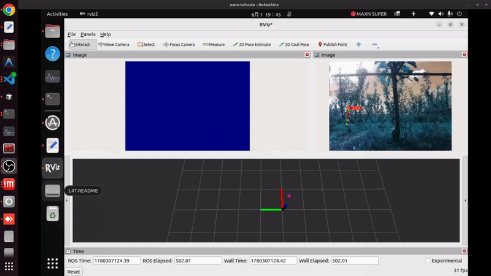

# 🚀 Object Detector for Mobile Robot (ROS2 Onboard Perception)


A real-time hybrid 2D/3D dynamic object detection and tracking system designed for autonomous mobile robots.

<div align="center">
  
</div>

## 📖 Overview
**Object Detector for Mobile Robot** (ROS2 package: `onboard_detector`) is an open-source, lightweight, and extensible perception system. It enables autonomous robots to detect, track, and classify dynamic obstacles in real time by fusing RGB vision and Depth geometries.

Built natively on **ROS2**, the system is highly optimized for edge deployment (such as Nvidia Jetson devices) and provides critical environment awareness for navigation, collision avoidance, and spatial monitoring frameworks.

## ✨ Core Features
- **Deep-Learning Vision (YOLOv8)**: Fast 2D object and pose/keypoint detection via PyTorch or accelerated via TensorRT (`.engine`).
- **3D Spatial Clustering (DBSCAN)**: Processes depth map projections and point clouds to extract accurate 3D bounding boxes.
- **Robust 3D Tracking**: Implements Data Association and a **Kalman Filter** to track objects across consecutive frames and predict future states.
- **Dynamic State Estimation**: Estimates physical velocity vectors to classify clustered obstacles as either *Dynamic* (moving) or *Static*.
- **Sensor-Fusion Noise Filtering**: Cross-verifies 2D visual semantics (YOLO) with 3D geometric clusters (DBSCAN) to effectively eliminate false positives and individual sensor noise, guaranteeing highly reliable final detections.
- **Proximity-Focused Perception**: Actively limits the detection scope to nearby obstacles, significantly reducing computational overhead and focusing on targets that truly matter for immediate collision avoidance.
- **ROS2 Native**: Exposes clean topics and customizable Services (e.g., `GetDynamicObstacles.srv`) for seamless integration with downstream planners.

## 🎯 Use Cases
- **Autonomous Navigation**: Provide real-time dynamic obstacle states (position, velocity) to local path planners for safe collision avoidance.
- **Indoor Service Robots**: Identify semantic objects (people, furniture) alongside their 3D physical coordinates.
- **Edge-AI Research**: Serve as a baseline architecture for fusing computationally cheap geometrical algorithms (C++) with modern deep learning (Python) on mobile platforms.

## 🧠 System Architecture

The project leverages a hybrid node architecture to maximize performance:

```text
[RGB Image] ───> YOLO Detector Node (Python) ───> 2D Bounding Boxes ──┐
                                                                      │ Data Association
[Depth/PCL] ───> U-V Projection & DBSCAN ───────> 3D Bounding Boxes ──┤
                       (C++ Node)                                     │ 
[Odometry]  ───> Ego-motion Compensation  ────────────────────────────┼──> Kalman Filter
                                                                                   │
                                  [Robot Decision & Navigation]  <── (Velocity & 3D State)
```

## 💻 Technologies
- **Framework:** ROS2 (C++ & Python3)
- **Computer Vision:** OpenCV, PyTorch, Ultralytics YOLO, TensorRT
- **Point Cloud / Math:** PCL (Point Cloud Library), Eigen3
- **Tracking Algorithm:** DBSCAN, Kalman Filter

## 🛠️ Installation & Setup

Ensure you have a working ROS2 environment (Foxy or Humble) with standard perception dependencies (`vision_msgs`, `pcl_conversions`).

**1. Clone the repository into your ROS2 workspace:**
```bash
cd ~/your_ros2_ws/src
git clone https://github.com/panyaoqiang/object-detector-for-mobile-robot.git onboard_detector
```

**2. Build the workspace:**
```bash
cd ~/your_ros2_ws
colcon build --packages-select onboard_detector
source install/setup.bash
```

## 🚀 Usage

Launch the complete perception pipeline (vision + 3D tracking):

```bash
ros2 launch onboard_detector dynamic_detector.launch.py \
    use_sim_time:=false \
    use_nano:=true \
    weights_path:=~/weights
```
*Note: Set `use_nano:=true` to infer via TensorRT engines for maximum FPS on edge devices.*

**Querying Moving Obstacles via Service:**
```bash
ros2 service call /get_dynamic_obstacles onboard_detector/srv/GetDynamicObstacles "{current_position: {x: 0.0, y: 0.0, z: 0.0}, range: 5.0}"
```

## 📂 Project Structure
```text
onboard_detector/
├── cfg/                # YAML configuration (tuning limits, tracking params, IOUs)
├── include/            # C++ Headers (DBSCAN, Kalman Filter, utilities)
├── launch/             # ROS2 Launch files
├── rviz/               # Pre-configured RViz2 visualizations
├── scripts/            # Python nodes (YOLO TensorRT/PyTorch inference)
├── src/                # C++ source code for 3D state tracking
├── srv/                # Custom ROS2 service definitions 
└── CMakeLists.txt / package.xml
```

## 🛣️ Roadmap
- [ ] Upgrade to YOLOv9/v11 support.
- [ ] Multi-camera fusion tracking.
- [ ] Integrate with ROS2 Nav2 costmaps.
- [ ] Further C++ optimization for memory footprint.

## 🤝 Contributing
Contributions are highly welcomed! Whether it is algorithm optimization, bug fixes, or new feature proposals, feel free to open an issue or submit a Pull Request.

## 📄 License
This project is licensed under the **MIT License**. See the `LICENSE` file for more details.

## 👨‍💻 Author
**Yaoqiang Pan**
- GitHub: [@panyaoqiang](https://github.com/panyaoqiang)

---
⭐️ *If you find this repository helpful for your robotics research or applications, please consider giving it a star!*
